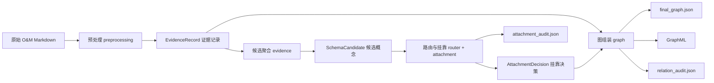

# CrossExtend-KG 项目介绍

这份文档面向第一次接触项目的人，目标不是解释某一段代码，而是把项目“到底在做什么、为什么这样设计、数据怎么流、最后会产出什么图”讲清楚。

如果只用一句话概括：

**CrossExtend-KG 是一个把工业运维手册自动整理成“可追溯知识图谱”的系统。**

它读入的是维修、检查、更换类的 O&M Markdown 手册，输出的是一张同时包含“操作流程”和“设备知识”的双层图谱，并且保留每个节点、每条边来自哪份文档、哪一步操作、为什么会被保留下来。

---

## 1. 先把项目讲成人话

可以把这个项目理解成一个“懂工业手册的结构化整理器”。

平常我们看到一份运维文档，内容通常像这样：

1. 先检查什么
2. 再拆开什么
3. 观察到什么现象
4. 由什么现象判断出什么故障
5. 最后修什么、验证什么

人读这样的手册不难，但机器如果想真正“理解”，就必须把里面的内容拆成几类对象：

- 这是第几步
- 这一步在操作什么对象
- 这个对象是零件、信号、状态，还是故障
- 哪些现象指向哪些故障
- 哪些部件属于哪个总成
- 整个流程先后顺序是什么

CrossExtend-KG 做的，就是把这些零散文字变成一张结构化图谱。

这张图谱不是普通的“名词关系图”，而是两层一起保留：

- **流程层**：T1、T2、T3 这些步骤本身，表示“人应该怎么做”
- **语义层**：部件、状态、信号、故障这些知识点，表示“系统里到底发生了什么”

这样做的好处是：

- 外行能看懂流程
- 工程师能追溯每个判断来自哪一步
- 后续做检索、问答、诊断推荐时，不会只得到一个抽象名词，而是能回到具体操作链路

---

## 2. 项目当前实际边界

这不是一个“什么文档都能吃”的通用知识图谱平台。按当前代码实现，它有非常明确的边界。

### 2.1 当前输入

当前只接受一种主输入：

- `om_manual`，也就是工业运维、维修、检查类 Markdown 手册

对应代码里的核心约束是：

- 文件必须符合 O&M 文档命名或内容约定
- 不符合约定时直接报错
- **没有静默 fallback**

换句话说，这个系统不是“随便喂一段文本试试看”，而是一个有输入合同的数据生产线。

### 2.2 当前领域

当前项目围绕 3 个领域组织：

- `battery`：电池系统
- `cnc`：数控机床
- `nev`：新能源车/电动车相关系统

仓库里原始 Markdown 语料规模是：

| 领域 | 原始 Markdown 数量 |
|------|-------------------|
| battery | 100 |
| cnc | 100 |
| ev / nev | 200 |

但当前主线 benchmark 和回归实验，并不是只围绕少数文档，而是涵盖了从单文档到全量 400 篇的多层实验体系：

- `test1`：1 篇文档（规则回归）
- `test2`：3 篇文档，每域 1 篇（规则回归）
- `test3`：9 篇文档，每域 3 篇（规则回归）
- **全量预处理**：400 篇文档，2026-05-02 完成（deepseek-v4-pro，59.4 小时）

这也是仓库里 `data/evidence_records/*.json` 和 `config/persistent/pipeline.{test1,test2,test3,full}.yaml` 的实际用途。

### 2.3 当前输出

项目当前的核心输出不是报告，也不是结论摘要，而是**可审计的图谱构建产物**：

- `final_graph.json`
- `attachment_audit.json`
- `relation_audit.json`
- `.graphml`

这几个文件共同回答四个问题：

1. 最终图谱长什么样
2. 哪些概念被接纳，挂到了哪里
3. 哪些关系被保留，哪些被拒绝
4. 每个结果来自哪份证据文档

---

## 3. 项目解决的核心问题

工业手册里最大的难点，不是“识别几个实体名词”，而是下面这几件事同时成立：

### 3.1 流程必须保留

很多传统知识图谱只关心“部件 A 属于设备 B”“故障 C 导致状态 D”，但运维场景真正重要的是：

- 第一步先看什么
- 第二步拆什么
- 第三步根据什么信号做判断
- 第四步修什么
- 第五步如何验证修好

如果把流程抹掉，只剩静态关系图，图谱就很难直接服务维修流程。

### 3.2 不同领域词不一样，但上层含义相近

比如：

- 电池领域里的 `O-ring`
- CNC 里的 `cover gasket`
- 新能源车里的 `door seal`

词面不同，但本质都属于“密封件”。

项目通过 `shared_hypernym` 机制，把这些跨域概念挂到同一上位类，例如 `Seal`，这样不同领域的图就能对齐。

### 3.3 同一个现象和最终故障之间，常常隔着多步推理

例如：

- T3 看到划痕
- T5 发现受力痕迹
- T7 才最终判断是某个干涉或错位故障

这不是一个平面的“三元组”就能表达清楚的，所以项目专门保留：

- `step_phase`
- `diagnostic_edges`
- `cross_step_relations`
- `state_transitions`

用来表达“观察 -> 诊断 -> 修复 -> 验证”的链条。

---

## 4. 整体架构

从系统角度看，项目是一个典型的“分阶段流水线”。



如果再把“代码目录”和“职责”一一对应起来，可以看到项目结构非常清楚：

| 模块 | 作用 |
|------|------|
| `cli.py` | 命令行入口，负责 `preprocess`、`run`、`evaluate`、`replay`、`rollback` |
| `preprocessing/` | 把原始 Markdown 抽成结构化证据 |
| `pipeline/evidence.py` | 证据加载、标准化、候选概念聚合 |
| `pipeline/router.py` | 用 embedding 给候选概念做 backbone 路由排序 |
| `pipeline/attachment.py` | 用规则或 LLM 决定候选概念最终挂到哪里 |
| `rules/` | 对概念挂靠和关系保留做安全过滤 |
| `pipeline/graph.py` | 把流程层和语义层真正组装成图 |
| `pipeline/artifacts.py` | 把图和审计结果导出成文件 |
| `pipeline/exports/graphml.py` | 导出 GraphML，便于 Gephi / yEd 等工具查看 |
| `backends/` | 对接 LLM、Embedding、FAISS 缓存 |
| `rules/` | 对概念挂靠和关系保留做安全过滤 |
| `temporal/` | 时间快照、生命周期事件等扩展能力 |
| `tests/` | 双层图谱与 v2 逻辑的回归测试 |

---

## 5. 项目里最重要的设计思想

### 5.1 双层图，而不是单层图

项目把最终图谱拆成两层。

#### 流程层 workflow

这一层存的是步骤本身，例如：

- `DOC:T1`
- `DOC:T2`
- `DOC:T3`

以及步骤之间的关系：

- `T1 -> T2` 表示顺序推进
- `T3 -> 裂纹` 表示这一步检查到了“裂纹”这个对象

#### 语义层 semantic

这一层存的是业务对象：

- 设备
- 部件
- 信号
- 状态
- 故障
- 以及密封件、连接器、控制器、冷却相关对象等上位类

这样设计后，系统不会把“维修流程”误当成“普通实体”。

### 5.2 固定 backbone，避免图谱无限长歪

项目没有放任 LLM 自由生成无限多“上位类”，而是固定了一套 15 个 backbone 概念：

#### Tier 0：基础语义类

- `Asset`
- `Component`
- `Signal`
- `State`
- `Fault`

#### Tier 1：跨领域上位锚点

- `Seal`
- `Connector`
- `Sensor`
- `Controller`
- `Coolant`
- `Actuator`
- `Power`
- `Housing`
- `Fastener`
- `Media`

可以把它理解成项目先准备好 15 个“抽屉”，后面抽出来的概念都要尽量放进这些抽屉里。

这样做的收益很直接：

- 结构稳定
- 跨域对齐容易
- 审计简单
- 不会因为模型风格变化而让图谱架构漂移

### 5.3 流程步骤不再假装成普通语义节点

旧式做法常把步骤也当成 `Task` 概念。这个项目当前主线已经把这件事拆开了：

- 流程步骤是真实的 `workflow_step`
- 语义概念是 `semantic` 节点
- `Task` 只在评估兼容旧标注时作为投影概念保留

这对外行也很好理解：

“检查密封圈”这件事本身，不等于“密封圈”这个对象。

---

## 6. 从输入到输出，数据到底怎么走

### 6.1 Stage 0：原始文档

输入文件在：

- `data/battery_om_manual_en/`
- `data/cnc_om_manual_en/`
- `data/ev_om_manual_en/`

文档通常是 Markdown 表格形式，每一行代表一个时间步骤：

```markdown
| Time step | O&M sample text |
|---|---|
| T1 | 先记录问题背景... |
| T2 | 暴露相关部件... |
| T3 | 检查裂纹、热斑、缺失卡扣... |
```

这里最关键的信息有两类：

- `T1/T2/T3` 这样的步骤编号
- 每一步里的操作对象、观察现象、故障线索、验证条件

### 6.2 Stage 1：预处理抽取

这一步由 `preprocessing/` 完成，内部又分 3 件事：

1. `parser.py`
   负责读 Markdown、识别是否符合 O&M 文档合同、提取标题和时间戳
2. `extractor.py`
   调用 LLM，把文档抽成概念与关系
3. `processor.py`
   把 LLM 返回结果整理成统一的 `EvidenceRecord`

当前默认后端来自配置中心：

- LLM：`deepseek-v4-pro`（全量实验）/ `deepseek-v4-flash`（轻量测试）
- Embedding：`text-embedding-v4`

这里的输出是整个项目最重要的中间层格式：`EvidenceRecord`。

### 6.3 Stage 2：证据标准化与候选聚合

这一阶段不再调用外部 API，而是纯 Python 处理。

主要做几件事：

- 统一标签格式
- 把复数、变体、别名尽量归并
- 统计某个概念出现在哪几步、参与了多少关系
- 推断它更像 `Component`、`Signal`、`Fault` 哪一类
- 把 `shared_hypernym` 传到路由特征里

输出对象叫 `SchemaCandidate`，可以理解成：

**“这是一个值得考虑进入图谱的候选概念，它当前有哪些证据支持。”**

### 6.4 Stage 3：挂靠决策

这一阶段回答的是：

**“这个候选概念，最后应该挂到哪一个 backbone 概念下面？”**

流程是两段式：

1. `router.py`
   用 embedding 先做一个粗排序
2. `attachment.py`
   用规则或 LLM 做最终决策

决策结果叫 `AttachmentDecision`，常见有三种：

- `reuse_backbone`
- `vertical_specialize`
- `reject`

例如：

- `coolant hose` 可能挂到 `Coolant`
- `O-ring` 可能挂到 `Seal`
- `retaining bolt` 可能挂到 `Fastener`
- `release boundary` 这种过于抽象、图价值低的词可能被拒绝

### 6.5 Stage 4：组装双层图

这一步由 `pipeline/graph.py` 完成。

它把两类输入合在一起：

- `EvidenceRecord`
- `AttachmentDecision`

然后生成一张真正可用的图。

图组装时会同时产出：

- backbone 节点
- adapter 概念节点
- workflow 步骤节点
- `is_a` 语义挂靠边
- workflow 顺序边
- workflow 到语义对象的 grounding 边
- structural / communication / propagation / lifecycle 语义边

### 6.6 Stage 5：导出与审计

导出由 `pipeline/artifacts.py` 和 `pipeline/exports/graphml.py` 完成。

每个 domain 最终会看到三类核心文件：

- `final_graph.json`
- `attachment_audit.json`
- `relation_audit.json`

如果开启 GraphML 导出，还会在顶层 `graphml/` 目录下生成：

- `battery.graphml`
- `cnc.graphml`
- `nev.graphml`

### 6.7 把一份文档从头走一遍，会发生什么

如果把系统想成一条“装配流水线”，那么一份原始文档进入系统后，大致会经历下面这个过程。

#### 第 1 步：先确认这是不是一份合格原料

`preprocessing/parser.py` 会先检查：

- 文件名是否像 O&M 文档
- 内容里是否有 `Time step` 这种结构
- 每一行是否像 `T1 / T2 / T3` 这样的步骤

如果这里不合格，系统不会“凑合着抽一下”，而是直接停下来报错。原因很简单：一旦入口合同不严，后面生成的图再漂亮，也可能是建立在错误输入上的。

#### 第 2 步：把原文拆成“步骤 + 对象 + 关系”

举一个外行最好理解的例子：

原文里如果有一句：

```text
T2：暴露 busbar shield、retaining tabs、busbar edges……
```

那么 LLM 抽取后，系统不会只记住一段话，而会尽量拆成：

- 这是 `T2`
- 这一步的动作更接近 `expose`
- 这一步提到了 `busbar shield`
- 这一步提到了 `retaining tabs`
- 这一步提到了 `busbar edges`
- 这些对象与 `T2` 之间存在动作关系

也就是说，项目不是在做“全文摘要”，而是在做“把句子拆成图元”。

#### 第 3 步：把零散提法合并成候选概念

同一个对象在文档里不一定只出现一次。

比如某个部件可能在：

- T1 被点名
- T2 被操作
- T3 又被检查

这时候 `pipeline/evidence.py` 会尽量把这些出现痕迹归并成一个候选概念，而不是让图里出现 3 个名字相似、其实说的是同一个东西的节点。

#### 第 4 步：判断这个候选概念应该归到哪一类

接下来系统会问一个很重要的问题：

**“这个词是设备、部件、信号、状态、故障，还是更具体地属于密封件、连接器、冷却系统之类？”**

这里项目会综合使用：

- 文本本身
- 描述文字
- 它参与了什么关系
- 它出现在什么步骤里
- 它有没有 `shared_hypernym`

最终把它挂到某个 backbone 锚点之下。

#### 第 5 步：把“流程”和“语义”同时画出来

等到概念挂靠完成，`pipeline/graph.py` 才开始真正组装图：

- 一方面创建 `T1 -> T2 -> T3` 这样的流程顺序
- 另一方面创建 `T2 -> busbar shield` 这样的步骤到对象的 grounding
- 同时再创建 `busbar shield -> Housing` 这样的语义挂靠边

于是同一个对象在图里就有了“两种身份”：

- 它在流程里被谁处理过
- 它在语义上属于哪个上位类

#### 第 6 步：输出“看图文件”和“查账文件”

最后系统不会只给你一张图，而是至少给两类结果：

- 给人看全貌的 `final_graph.json` / GraphML
- 给工程师排查原因的 `attachment_audit.json` / `relation_audit.json`

这也是项目和很多“只吐一个最终结果”的脚本式方案最大的不同：它不是黑盒。

### 6.8 这个系统在什么地方会故意失败

这个项目有一个很重要的工程原则：**宁可明确失败，也不做偷偷摸摸的自动兜底。**

在真实代码里，下面几种情况都会显式失败：

- 原始 Markdown 不符合 O&M 合同
- 预处理没有配置好 LLM
- pipeline 找不到指定的 evidence records 文件
- LLM attachment 某一批决策失败
- GraphML 导出时发现边的端点在节点表里不存在

从产品角度看，这样似乎“脾气有点大”；但从知识图谱工程角度看，这是必要的。因为一张错误但看起来还不错的图，往往比直接报错更危险。

### 6.9 实际运行时，通常怎么使用这条流水线

项目里最常见的命令分成 3 类。

#### 先做预处理

```bash
python -m crossextend_kg.cli preprocess --config config/persistent/preprocessing.deepseek.yaml
```

这一步的目标是把原始 Markdown 变成 `data/evidence_records/*.json`。

#### 再跑主 pipeline

```bash
python -m crossextend_kg.cli run --config config/persistent/pipeline.test3.yaml
```

这一步的目标是把 `EvidenceRecord` 进一步变成最终图谱和审计产物。

如果只想跑某几个领域，也可以：

```bash
python -m crossextend_kg.cli run --config config/persistent/pipeline.test3.yaml --domains battery cnc
```

#### 最后做评估

```bash
python -m crossextend_kg.cli evaluate --gold <gold.json> --graph <final_graph.json>
```

或者针对整次运行：

```bash
python -m crossextend_kg.cli evaluate --run-root <run_dir> --variant full_llm --ground-truth-dir <gold_dir>
```

从外行视角可以这样理解：

- `preprocess`：把文档拆开
- `run`：把拆开的东西接成图
- `evaluate`：拿人工标准答案来检查这张图靠不靠谱

---

## 7. 最重要的数据格式

### 7.1 EvidenceRecord：文档级证据记录

它表示“这一整份文档，已经被拆成结构化证据了”。

简化后的结构如下：

```json
{
  "evidence_id": "Battery_Module_Busbar_Insulator_Shield_Inspection",
  "domain_id": "battery",
  "role": "target",
  "source_type": "om_manual",
  "timestamp": "2026-04-26T00:00:00Z",
  "raw_text": "...原始 Markdown ...",
  "step_records": [],
  "document_concept_mentions": [],
  "document_relation_mentions": [],
  "procedure_meta": {},
  "cross_step_relations": []
}
```

其中最值得关注的是：

- `step_records`
- `procedure_meta`
- `cross_step_relations`

### 7.2 StepEvidenceRecord：步骤级证据

这是项目里最关键的结构。

```json
{
  "step_id": "T3",
  "task": { "label": "T3", "surface_form": "Inspect the shield for cracks..." },
  "concept_mentions": [],
  "relation_mentions": [],
  "step_phase": "observe",
  "step_summary": "Inspect the shield for cracks...",
  "surface_form": "完整原句",
  "step_actions": [
    { "action_type": "inspects", "target_label": "cracks" }
  ],
  "structural_edges": [],
  "state_transitions": [],
  "diagnostic_edges": [],
  "sequence_next": "T4"
}
```

外行理解时，可以把这些字段简单记成：

- `step_phase`：这一步是在观察、诊断、修复还是验证
- `step_actions`：这一步具体动了什么对象
- `sequence_next`：下一步是什么
- `diagnostic_edges`：这一步里出现了什么诊断性证据

### 7.3 SchemaCandidate：候选概念

候选概念可以理解成“准备进图谱的词条草案”。

```json
{
  "candidate_id": "battery::busbar shield",
  "domain_id": "battery",
  "label": "busbar shield",
  "description": "shield covering busbar",
  "evidence_ids": ["Battery_Module_Busbar_Insulator_Shield_Inspection"],
  "routing_features": {
    "semantic_type_hint": "Component",
    "shared_hypernym": "Housing",
    "relation_families": ["task_dependency", "structural"],
    "step_ids": ["T1", "T2", "T3"]
  }
}
```

### 7.4 AttachmentDecision：挂靠决策

```json
{
  "candidate_id": "battery::busbar shield",
  "label": "busbar shield",
  "route": "vertical_specialize",
  "parent_anchor": "Housing",
  "accept": true,
  "admit_as_node": true,
  "reject_reason": null,
  "confidence": 0.85,
  "justification": "anchored by shared hypernym and relation context"
}
```

### 7.5 final_graph.json：最终图谱

最终导出的图结构长这样：

```json
{
  "domain_id": "battery",
  "summary": {
    "node_count": 132,
    "edge_count": 206,
    "workflow_step_node_count": 21,
    "semantic_node_count": 111,
    "workflow_edge_count": 95,
    "semantic_edge_count": 111,
    "accepted_triple_count": 110,
    "hypernym_coverage": 0.4234,
    "phase_distribution": {
      "observe": 11,
      "diagnose": 2,
      "verify": 4
    }
  },
  "relation_validation": {},
  "nodes": [],
  "edges": []
}
```

这是给“结果使用方”最有价值的一份文件。

### 7.6 `attachment_audit.json`：概念挂靠审计账本

如果 `final_graph.json` 是“成品图”，那么 `attachment_audit.json` 就是“概念审批记录”。

它最适合回答的问题是：

- 为什么这个词进图了
- 它为什么挂到这个 anchor 下面
- 为什么另一个词被拒绝了

它的顶层通常包含：

- `summary`
- `items`

其中 `summary` 会告诉你：

- 一共有多少候选概念
- 多少被接纳为 adapter concept
- 多少被拒绝
- 被拒绝的原因分布

而 `items` 里每一项都同时保留：

- 原始 candidate
- retrieval 结果
- 最终 decision

这意味着如果有人问：

**“为什么 `Aurex ModulePad-495` 被当成 `Asset`？”**

你不是只能回答“模型这么判的”，而是能回到：

- 这个词的描述是什么
- 它出现在哪个文档
- 它带了什么 routing feature
- 它最终是被规则判定，还是被 LLM 判定

对调试来说，这非常关键。

### 7.7 `relation_audit.json`：关系保留与拒绝的审计账本

很多人第一次看项目时，会误以为：

“只要概念进图了，关系就一定会进图。”

实际上不是。关系还有自己单独的一层验证逻辑，而 `relation_audit.json` 就是记录这层逻辑的地方。

它通常会包含这些信息：

- `candidate_relation_count`
- `accepted_count`
- `rejected_count`
- `rejected_type_count`
- `reject_reason_counts`
- `display_action_counts`
- `hidden_display_counts`

这里有两个很容易混淆的概念：

#### 第一类：关系被拒绝

例如：

- 类型不合法
- 结构边价值太低
- 单步内的诊断假设不值得保留

这类关系不会进入最终可用图边集合。

#### 第二类：关系被保留，但不展示

例如某些 workflow 边虽然逻辑成立，但展示价值不高，系统就会：

- 在 JSON 里保留
- 在 GraphML 可视化里隐藏

这就是为什么 `relation_audit.json` 比单纯看 GraphML 更接近真实全貌。

### 7.8 GraphML：给图工具看的导出格式

GraphML 不是新的业务语义层，而是导出格式。

它主要解决的是：

- 用 Gephi、yEd 等软件打开
- 直接观察图结构
- 按属性筛选节点和边

当前代码里，GraphML 会保留很多对可视化很有帮助的属性：

#### 节点属性

- `label`
- `display_label`
- `domain_id`
- `node_type`
- `node_layer`
- `parent_anchor`
- `surface_form`
- `step_id`
- `order_index`
- `shared_hypernym`
- `step_phase`

#### 边属性

- `label`
- `display_label`
- `family`
- `edge_layer`
- `workflow_kind`
- `edge_salience`
- `display_admitted`
- `display_reject_reason`
- `source_field`
- `head_step`
- `tail_step`
- `mechanism`

对外行来说，可以把它理解成：

`final_graph.json` 更像数据库导出，GraphML 更像带属性的关系图视图。

---

## 8. 最终图谱到底长什么样

### 8.1 从结构上看

最终图谱是一张**有向双层图**。

#### 流程层节点

例如：

- `Battery_Module_Busbar_Insulator_Shield_Inspection:T1`
- `Battery_Module_Busbar_Insulator_Shield_Inspection:T2`

这些节点代表真实的维修步骤。

#### 语义层节点

例如：

- `busbar shield`
- `heat spot`
- `crack`
- `coolant hose`
- `BMS enclosure seal`

这些节点代表零件、现象、状态和故障。

#### workflow 边

例如：

- `T1 -> T2`：顺序边
- `T3 -> crack`：这一步检查到了裂纹

#### semantic 边

例如：

- `busbar shield -> Housing`：这是一个挂靠关系 `is_a`
- `battery pack -> coolant hose`：结构关系 `contains`
- `seepage -> corrosion`：诊断或传播关系

### 8.2 从展示上看

项目里当前已经有实际可视化产物，位于 `artifacts/figures/`。

下面这张是当前仓库中的整体架构图：


下面这张是电池域双层图示例：


如果把图再说得更直白一点，它看起来像这样：

```text
流程步骤串成一条线：
T1 -> T2 -> T3 -> T4 -> T5 ...

每个步骤再向下指到它操作或观察的对象：
T3 -> crack
T3 -> heat spot
T5 -> failed tab

而对象之间自己也有语义关系：
battery pack -> contains -> coolant hose
seepage -> indicates -> corrosion
misalignment -> causes -> leak
```

### 8.3 `final_graph.json` 和 GraphML 的区别

这一点很重要。

#### `final_graph.json`

它是**全量可审计结果**，里面保留：

- 全部节点
- 全部边
- 哪些边被展示
- 哪些边被隐藏
- 被隐藏的原因是什么

#### `.graphml`

它是**面向图形工具的可视化版本**。

按当前代码实现，GraphML 只导出：

- `display_admitted = true` 的边
- 与这些边相连的节点

所以 GraphML 看上去通常会比 `final_graph.json` 更“干净”，因为那些低价值、只保留审计意义的边不会画出来。

### 8.4 用一份真实结果来读图，不要只停留在抽象定义

以仓库里的 `results/regression_v2/test3/working/battery/final_graph.json` 为例，`summary` 里能看到：

- `node_count = 132`
- `edge_count = 206`
- `workflow_step_node_count = 21`
- `semantic_node_count = 111`
- `workflow_edge_count = 95`
- `semantic_edge_count = 111`
- `readable_node_count = 122`
- `readable_edge_count = 197`
- `accepted_triple_count = 110`

这些数字并不是统计装饰，而是能直接帮助理解项目输出。

#### `workflow_step_node_count = 21`

表示这 3 篇 battery 文档总共沉淀出了 21 个真实流程步骤节点。

从业务意义上说，它回答的是：

**“系统一共识别出了多少个真正可操作的维修步骤。”**

#### `semantic_node_count = 111`

表示在这 21 个步骤背后，一共保留了 111 个语义对象。

这说明图谱不是只把手册当流程图，而是确实把对象知识沉淀下来了。

#### `readable_node_count` 与 `readable_edge_count`

这两个字段特别值得给外行解释。

它们的含义不是“真实存在多少节点和边”，而是：

**“有多少节点和边值得在默认可视化视图里展示给人看。”**

也就是说：

- `node_count / edge_count` 更偏工程底账
- `readable_node_count / readable_edge_count` 更偏人类阅读体验

#### `accepted_triple_count`

它表示候选关系经过过滤和类型验证之后，真正进入图中的数量。

如果这个数很低，通常意味着两种可能：

- 文档本身可抽出的结构关系不多
- 或者抽出了不少，但很多被规则或类型约束挡掉了

### 8.5 为什么有些边“在 JSON 里有，在图里没有”

这是外行最容易误会的一点。

项目里存在 3 种完全不同的状态：

#### 状态 1：关系被接受，也被展示

这是最直观的一种。GraphML 里能看到，`final_graph.json` 里也能看到。

#### 状态 2：关系被接受，但默认不展示

这通常是出于可读性考虑。

例如：

- 某些过于上下文化的 workflow 边
- 指向 `Asset` 的背景边
- 对读图帮助不大、但保留审计意义的边

这类边在 `final_graph.json` 和 `relation_audit.json` 里仍然存在，只是 GraphML 默认不画。

#### 状态 3：关系被拒绝

这类边会在 audit 里留下痕迹，但不会进入最终接受边集合。

所以如果有人说：

“图里没看到这条边，是不是系统漏了？”

正确答案通常要先分辨：

- 它是没被生成
- 被生成但被拒绝
- 还是被生成并保留了，只是默认不展示

### 8.6 图谱不是“越满越好”，而是“越可解释越好”

很多第一次做图谱的人，会直觉觉得：

“边越多越厉害，节点越多越完整。”

但在这个项目里，目标不是把一切都画上去，而是让图具有：

- 结构一致性
- 领域可解释性
- 跨域可对齐性
- 人类可阅读性

因此系统宁愿：

- 拒绝一些低价值边
- 隐藏一些噪声边
- 不把抽象表述塞进图里

也不追求“看起来很热闹”的大杂烩图。

---

## 9. 图谱里的节点和边怎么读

### 9.1 节点类型

当前节点主要有 3 类：

| 节点类型 | 作用 | 例子 |
|---------|------|------|
| `backbone_concept` | 固定上位类 | `Asset`、`Signal`、`Seal` |
| `adapter_concept` | 真实业务概念 | `coolant hose`、`rub marks` |
| `workflow_step` | 真实流程步骤 | `DOC:T1`、`DOC:T2` |

### 9.2 workflow_step 节点包含什么

一个流程节点不仅有名字，还有附加语义：

- `label`（带文档作用域的步骤标签，如 `Battery_Pack_Coolant_Quick_Connector_Replacement:T1`）
- `step_id`（原始步骤号，如 `T1`）
- `display_label`
- `surface_form`
- `step_phase`
- `order_index`
- `provenance_evidence_ids`

所以一个步骤节点本身就已经足够拿来做流程浏览，也足够回溯到来源文档。

### 9.3 semantic 节点包含什么

语义节点常带这些信息：

- `parent_anchor`
- `shared_hypernym`
- `provenance_evidence_ids`

例如一个概念可以同时是：

- `semantic_type_hint = Component`
- `shared_hypernym = Seal`

这意味着它在基础类型上属于“部件”，在跨域统一类上更接近“密封件”。

### 9.4 边类型

项目里最常见的边有：

| 边族 | 代表含义 |
|------|---------|
| `is_a` | 概念挂靠到 backbone |
| `action_object` | 某一步操作了某个对象 |
| `task_dependency` + `workflow_kind=sequence` | 步骤之间前后相连 |
| `structural` | 物理结构关系，如包含、属于 |
| `communication` | 证据指向、信号提示 |
| `propagation` | 故障传播、因果影响 |
| `lifecycle` | 状态变化或生命周期变化 |

这里要注意：`sequence` 在最终图里不是独立的 `family`，而是
`family="task_dependency"` 下的一个 `workflow_kind`。

### 9.5 除了“是什么边”，还要会读“为什么是这样显示”

在这个项目里，一条边不仅仅有“头、尾、关系名”，它还有一组很重要的控制字段。

#### `display_label`

这是给人看的标签，不一定等于原始关系词。

比如原始关系可能是：

- `observes`
- `records`
- `confirms`

但在图上，为了让外行更容易看懂，系统可能把它们规范成：

- `inspect`
- `record`
- `verify`

#### `edge_salience`

它代表这条边在阅读时的重要程度，常见是：

- `high`
- `medium`
- `low`

可以把它理解成“推荐在图上强调到什么程度”。

#### `display_admitted`

这不是“这条边是否被接受”的同义词，而是：

**“这条边是否适合进入默认展示视图。”**

所以一条边可能：

- 在逻辑上是 accepted
- 但在展示上是 hidden

#### `display_reject_reason`

如果一条边不适合展示，这里会说明原因。

例如：

- `workflow_asset_context`
- `record_requires_signal_like_target`
- `unsupported_workflow_action`

这些原因主要服务于“为什么图上没画出来”的解释。

#### `source_field`

这个字段非常工程化，但非常重要，因为它直接告诉你这条边来自哪一层数据源。

常见取值有：

- `sequence_next`
- `step_actions`
- `attachment_decision`
- `cross_step_relations`

也就是说，你不仅知道“边存在”，还知道“它到底是根据哪个字段组装出来的”。

#### `head_step` / `tail_step`

对于跨步骤的语义关系，这两个字段能告诉你：

- 证据头部概念最早来自哪一步
- 证据尾部概念最早来自哪一步

这对诊断链追踪非常重要，因为它让图谱具备了“跨步骤推理轨迹”。

---

## 10. 每一块代码在整体中的角色

### 10.1 `cli.py`

它是整个项目对人的入口，支持 5 个主要动作：

- `preprocess`
- `run`
- `evaluate`
- `replay`
- `rollback`

### 10.2 `preprocessing/`

这是“原料清洗车间”。

#### `parser.py`

负责确认输入是不是合法 O&M 文档。

#### `extractor.py`

负责调用 LLM 做抽取，抽取目标包括：

- concepts
- relations
- state_transitions
- diagnostic_edges

#### `processor.py`

负责把 LLM 输出从“一个大 JSON”整理成工程真正可用的结构，还会：

- 识别 `T1/T2/T3`
- 给步骤推断 `step_phase`
- 自动生成 `sequence_next`
- 从 relation 里拆出 `step_actions`
- 构建 `cross_step_relations`
- 推断 `procedure_meta`

### 10.3 `pipeline/evidence.py`

这是“概念汇总台”，把不同步骤、不同文档中出现的概念合并成候选概念，并给每个候选概念打上统计特征。

### 10.4 `pipeline/router.py`

这是“先粗分一下类”的模块。它不做最终裁决，只做一件事：

**算这个概念更像哪个 backbone。**

当前支持两种模式：

- `baseline`
- `contextual_rerank`

### 10.5 `pipeline/attachment.py`

这是“最终挂靠裁判”，综合候选概念文本、embedding 排序结果、routing features 和 backbone 描述给出最终决策。

配置上支持 3 种策略：

- `llm`
- `embedding_top1`
- `deterministic`

### 10.6 `rules/`

这是“安全护栏”，防止低价值或危险概念进入图谱，比如：

- 人名
- 文档名
- 太泛的占位词
- 不应该挂到 `Task` 下的概念

### 10.7 `pipeline/graph.py`

这是整个项目的“装配总线”，负责：

- 节点 materialize
- 边过滤
- 类型约束校验
- 可视化显示策略
- 时间快照组织

### 10.8 `pipeline/artifacts.py`

这是“成品打包模块”，把结果写成用户真正能消费的文件：

- `backbone_final.json`
- `construction_summary.json`
- `attachment_audit.json`
- `relation_audit.json`
- `final_graph.json`

### 10.9 `tests/` 与评估脚本

- `tests/`：工程回归与行为约束（19 个测试：12 v1 + 7 v2）
- `scripts/`：回归测试、评估与全量运行脚本

### 10.10 `config/persistent/`：项目真正的运行控制中心

很多人第一次看仓库，会先盯着代码看很久，但对这个项目来说，配置文件同样重要。

当前真正决定“系统怎么跑”的核心配置在 `config/persistent/` 下。

#### `pipeline.base.yaml`

它定义的是主 pipeline 的公共基线，包括：

- 15 个 backbone 概念
- 允许的路由类型
- artifact 根目录
- relation constraints 路径
- 是否写 GraphML
- 是否启用 embedding cache

可以把它理解成“整条生产线的总装标准”。

#### `pipeline.test1.yaml / test2.yaml / test3.yaml`

它们是在公共基线之上，指定不同实验规模的数据输入：

- 单文档
- 三文档
- 九文档

这意味着项目并不是每次都从零写配置，而是通过 `extends` 方式叠加。

#### `preprocessing.base.yaml`

它定义预处理阶段的公共参数，例如：

- `data_root`
- `domain_ids`
- `output_path`
- prompt 模板路径
- 关系家族

#### `llm_backends.yaml`

当前默认 LLM backend 是：

- `deepseek`

并通过环境变量读取：

- `DEEPSEEK_API_KEY`

#### `embedding_backends.yaml`

当前默认 embedding backend 是：

- `dashscope_text_embedding_v4`

并通过环境变量读取：

- `TONGYI_API_KEY`

所以从运维角度看，这个项目并不是“把 key 写死在脚本里”，而是有一套相对规范的后端注册机制。

### 10.11 `relation_constraints.json`：关系类型守门员

这个文件常被忽略，但它对最终图形态影响很大。

它为每种 relation family 规定了：

- 允许的 head 类型
- 允许的 tail 类型
- 对应的语义规则

比如：

- `structural` 只允许物理实体之间发生
- `communication` 更适合由 `Component / Signal / State` 发出证据
- `lifecycle` 的尾部应该是 `State`

这意味着系统不是“LLM 说有关系就有关系”，而是：

1. 先抽出来
2. 再看业务规则接不接受
3. 最后才进入成图结果

这就是为什么项目能把“语言模型生成能力”和“工程约束能力”结合起来。

### 10.12 `temporal/`：时间与生命周期能力为什么存在

虽然当前公开主线最显眼的是双层图，但项目代码里还保留了时间相关能力：

- `snapshot`
- `temporal_assertions`
- `lifecycle_events`

它们的意义是：

- 不只关心“图现在长什么样”
- 还关心“图是怎样一步步长成现在这样的”

在某些 variant 或实验里，系统可以为每份文档处理后的状态保留快照，这对回放、回滚、追踪构图过程很有帮助。

从外行角度可以把它理解成：

**项目不仅想给你结果，还想给你结果形成的时间轨迹。**

---

## 11. 项目当前真实数据流示例

如果以回归实验 `results/regression_v2/test3/` 为例，它的目录结构大致是：

```text
results/regression_v2/test3/
  backbone_final.json
  construction_summary.json
  run_meta.json
  working/
    battery/
      attachment_audit.json
      final_graph.json
      relation_audit.json
    cnc/
      ...
    nev/
      ...
```

这套结构非常适合排查问题，因为它把过程拆开了：

- 如果你怀疑“概念挂错了”，先看 `attachment_audit.json`
- 如果你怀疑“边被过滤了”，看 `relation_audit.json`
- 如果你只关心最终图，直接看 `final_graph.json`

### 11.1 如果按“整次运行”去读目录，应该怎么读

一次完整运行通常会出现几层目录。

#### 第一层：run 根目录

这里通常会放：

- `benchmark_meta.json`
- `benchmark_summary.json`

它们更多是面向“这次运行整体情况”的摘要。

#### 第二层：variant 目录

例如：

- `full_llm`
- `baseline_embedding_llm`
- `contextual_rerank_embedding_llm`
- `pure_llm`

这一层对应的是“同一批数据、不同策略”的横向比较。

#### 第三层：`working/<domain>/`

这一层才是看具体领域图谱和审计结果的地方。

如果要给新人一句最实用的提示，那就是：

**先定位到你关心的 variant，再进入对应 domain，看 `final_graph.json + attachment_audit.json + relation_audit.json`。**

### 11.2 如果按“排查问题”去读目录，建议顺序是什么

#### 场景 1：图上少了一个概念

先看：

1. `attachment_audit.json`
2. 是否被 `reject`
3. `reject_reason` 是什么

#### 场景 2：概念在图里，但挂错了上位类

先看：

1. `attachment_audit.json` 里的 `routing_features`
2. retrieval 排名
3. 最终 `parent_anchor`

#### 场景 3：边没显示出来

先看：

1. `relation_audit.json`
2. 是 `rejected` 还是 `display_admitted = false`
3. 对应的 `display_reject_reason`

#### 场景 4：可视化图太乱

先看：

1. 这是不是 GraphML 默认展示问题
2. 某些边是否本就被设计为隐藏
3. 你要看的其实是不是 `final_graph.json` 而不是 GraphML

这套排查路径，本质上也是项目“可审计设计”的价值体现。

---

## 12. 当前项目的实际效果

### 12.1 九文档规则回归结果

`results/regression_v2/test3_report.json` 给出的总结果是：

| 域 | 节点数 | 边数 | 接受三元组 |
|----|-------|------|-----------|
| battery | 132 | 206 | 110 |
| cnc | 160 | 275 | 156 |
| nev | 173 | 314 | 181 |
| 合计 | 465 | 795 | 447 |

另外，跨域上位类一致性统计显示：

- `hypernym_labels = 118`
- `hypernym_consistent = 117`

也就是跨域上位类的一致性约为 **99.2%**。

### 12.2 九文档 embedding + LLM 消融

`results/ablation_embedding_test3/latest_summary.json` 反映了 3 个策略变体：

| 变体 | battery 接受三元组 | cnc 接受三元组 | nev 接受三元组 |
|------|-------------------|----------------|----------------|
| baseline_embedding_llm | 106 | 148 | 163 |
| contextual_rerank_embedding_llm | 107 | 151 | 174 |
| pure_llm | 106 | 150 | 174 |

这说明：

- `contextual_rerank_embedding_llm` 是当前表现最平衡的方案
- `nev` 域对路由策略最敏感
- `cnc` 域整体更稳定

### 12.3 图谱特征的直观含义

以 `battery` 的 `test3` 为例：

- `workflow_step_node_count = 21`
- `semantic_node_count = 111`
- `hypernym_coverage = 0.4234`
- `phase_distribution` 说明当前流程里观察类步骤最多，其次是验证和诊断

### 12.4 这些数字怎么转成非技术表达

如果是给非技术管理者、合作方或者答辩老师讲，可以把上面的数字翻译成更容易理解的话：

- 不是只抽了几个关键词，而是已经稳定构成了上百个业务节点
- 图里不只有静态设备部件，还有真实的维修步骤和步骤到对象的对应关系
- 不同领域之间已经开始共享一套上位概念体系，而不是每个领域各说各话
- 系统不只是“会抽”，而且“会筛”，所以最终保留的是相对更有解释价值的结构

也就是说，这个项目的成熟度不体现在“有没有接上大模型”，而体现在：

- 能不能稳定形成结构
- 能不能解释为什么这样形成
- 能不能跨领域对齐

### 12.5 为什么 `hypernym_coverage` 值得持续关注

`hypernym_coverage` 可以简单理解为：

**“有多少语义节点已经成功对齐到跨领域统一上位类。”**

这个数不是越高越绝对正确，但它很有参考价值。

如果这个比例长期偏低，通常意味着：

- LLM 在抽取阶段没有稳定产出 `shared_hypernym`
- 或者概念本身太零碎、太局部，难以归到统一上位类

如果这个比例逐步提高，则通常说明：

- 跨域标准化在增强
- 图谱更适合做 leave-one-domain-out 之类的泛化实验

从研究角度看，这个指标也直接对应了项目“跨域泛化能力”的说服力。

---

## 13. 为什么这个架构适合外行和工程团队同时使用

### 13.1 对外行友好

因为它不是只输出一堆抽象三元组，而是保留了：

- 第几步
- 做了什么
- 看到了什么
- 为什么判断成某个故障

### 13.2 对工程团队友好

因为每一步都有审计产物：

- 概念怎么来的
- 挂靠为什么这么判
- 关系为什么被拒绝
- 最终展示图为什么长这样

### 13.3 对扩展新领域友好

因为它不是把每个领域硬写死，而是靠：

- 固定 backbone
- `shared_hypernym`
- 统一 `EvidenceRecord` 格式

来做跨域对齐。

### 13.4 这个项目现在还不等于什么

为了避免误解，也需要把项目当前**不做的事情**说清楚。

它现在还不等于：

- 一个面向所有行业文档的通用抽取平台
- 一个直接给出维修结论的智能助手
- 一个完整的图数据库服务端
- 一个可以跳过人工审查直接上线的自动决策系统

它当前更准确的定位是：

**一个面向工业 O&M 文档的、可审计的、双层知识图谱构建引擎。**

把这个定位说清楚，反而更容易让外部理解它的真实价值。

---

## 14. 如果第一次接手项目，建议怎么理解它

最推荐的阅读顺序是：

1. 先看这份总览，知道项目全貌
2. 再看 `docs/SYSTEM_DESIGN.md`，理解硬约束
3. 再看 `docs/PIPELINE_DATA_FLOW.md`，理解端到端数据流
4. 再看 `docs/DATA_FLOW_DIAGRAM.md`，看真实样例格式
5. 最后回到代码，看 `cli.py -> preprocessing -> pipeline`

如果你更偏工程排障，建议直接从以下文件入手：

- `config/persistent/pipeline.test3.yaml`
- `data/evidence_records/*_test3_nine_docs.json`
- `results/regression_v2/test3/working/*/final_graph.json`
- `results/regression_v2/test3/working/*/attachment_audit.json`
- `results/regression_v2/test3/working/*/relation_audit.json`

### 14.1 如果你是不同角色，建议的切入方式也不同

#### 如果你是产品或业务同学

重点看：

- 这份总览
- `artifacts/figures/` 下的可视化图
- `final_graph.json` 的 `summary`

你的核心问题通常不是“模型怎么调”，而是：

- 这套系统能否把流程和对象讲清楚
- 它能否成为后续检索、问答、诊断的底座

#### 如果你是算法或 NLP 同学

重点看：

- `preprocessing/`
- prompt 模板
- `pipeline/router.py`
- `pipeline/attachment.py`

你的核心问题通常是：

- 概念抽取得稳不稳
- `shared_hypernym` 标得准不准
- rerank 是否真的改善了挂靠效果

#### 如果你是图谱或后端同学

重点看：

- `models.py`
- `pipeline/graph.py`
- `pipeline/artifacts.py`
- `config/persistent/relation_constraints.json`

你的核心问题通常是：

- 模型结构是否自洽
- 节点边是否可追溯
- 过滤规则是否稳定

### 14.2 第一次读图时，最容易产生的 5 个误解

#### 误解 1：节点越多越好

不对。节点多但没有统一结构，图就只是“词云”。

#### 误解 2：边越多越说明系统强

不对。很多低价值边会让图更难读、更难用。

#### 误解 3：GraphML 就代表最终全量结果

不对。GraphML 是展示视图，不等于全部底账。

#### 误解 4：LLM 抽出来什么，图里就一定是什么

不对。中间还有规则过滤、类型约束、显示策略。

#### 误解 5：这个项目只是“抽实体关系”

不对。它真正保留的是“流程 + 语义 + 审计链路”三件事。

### 14.3 如果要继续把这份文档用于培训，建议配套讲什么

如果后面你要拿这份文档给新人做培训，最适合再补的口头说明是：

1. 用一篇真实文档现场跑一遍 `preprocess`
2. 打开生成的 `EvidenceRecord` 解释字段
3. 再打开 `attachment_audit.json` 看一个概念的挂靠过程
4. 最后把 `final_graph.json` 和 GraphML 对照着讲

这样新同事会更容易建立“一个词是怎么一路走到图上的”这个完整脑图。

---

## 15. 一句话总结

CrossExtend-KG 的本质，不是“把文本抽成几个实体关系”，而是：

**把工业运维文档里的操作流程、对象语义、诊断线索和跨域共性，整理成一张可审计、可解释、可复用的双层知识图谱。**

它的价值不只在于“生成了一张图”，更在于这张图的每一部分都能回答：

- 它来自哪一步
- 它为什么被保留
- 它和其他领域怎么对齐
- 它最终能如何服务流程理解、检索和下游诊断
